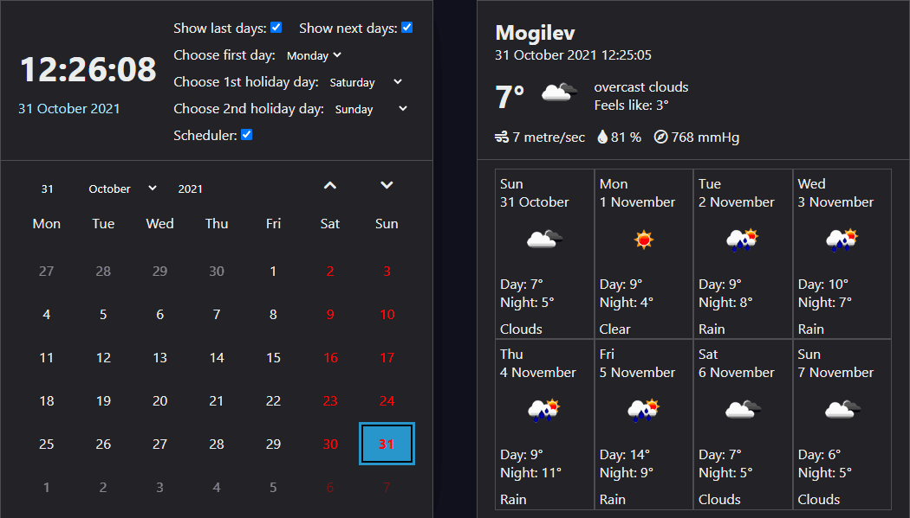

# Calendar and Weather on Pure JavaScript and HTML



## Installation

You need install JSON Server :

```
npm install -g json-server
```

And Start JSON Server

```
json-server --watch db/db.json
```

## Built with

- HTML
- CSS
- JavaScript
- Webpack
- JSON Server
- OpenWeatherMap API

## Functional
- Information stored in a database.
- Current Date is in blue color.
- Hover over a Date and the Date is in gray frame.
- By clicking on the date, open a modal window with a scheduler.
- Click the up and bottom arrows to move month to month.
- Weather updated every minute from the OpenWeatherMap API

## Author

👤 **Andrei Shinkarev**

- Github: [@andrei4ik1997](https://github.com/andrei4ik1997)
- Linkedin: [@Andrei Shynkarou](https://www.linkedin.com/in/andrei-shynkarou-874425223/)